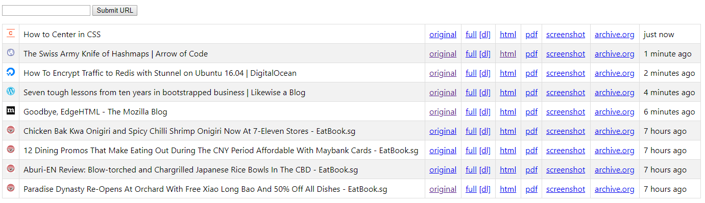

# ark

🚢 A self-hosted, personal archival application

## Items archived

- Full webpage
- DOM only
- PDF
- Screenshot
- Submission to archive.org

## Usage

- Download [zip](https://github.com/ShaunLWM/ark/archive/master.zip)
- Extract zip and enter directory
- `yarn install` or `npm install`
- `yarn start` or `npm start`
- Navigate to `http://localhost:8081`

## Credits

- [ArchiveBox](https://github.com/pirate/ArchiveBox)

## License

MIT - [ShaunLWM](https://github.com/ShaunLWM)
